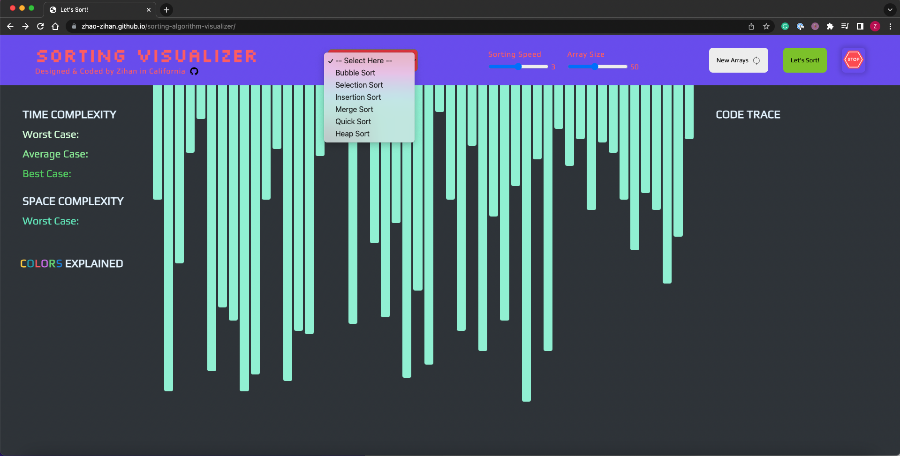
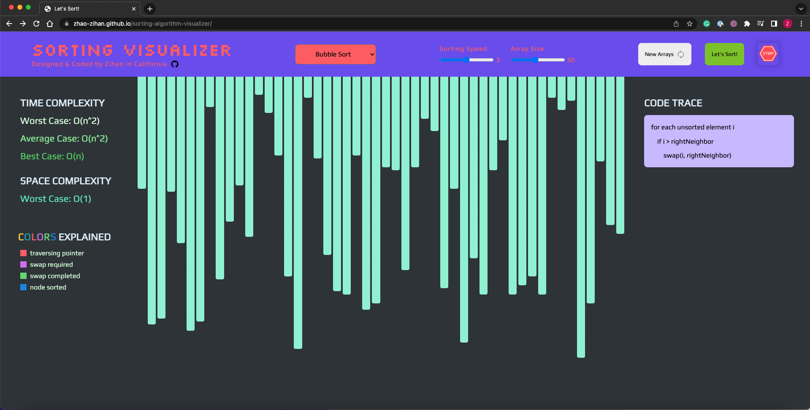

# Sorting Visualizer

A webpage that shows the logic behind common sorting algorithms based on HTML, CSS, and vanilla JavaScript.

## Algorithms included on this page:

- Bubble Sort
- Selection Sort
- Insertion Sort
- Merge Sort
- Quick Sort
- Heap Sort

## Screenshot:

## Layout Explained:

1. Select algorithm your desired algorithm from the top middle orange red selection box, a drop-down list will be toggled once you clicked on it.
2. Customize running speed and the number of bars from the sliders that are next to the algorithm selection box.
3. The white button with text 'New Arrays' is for randomizing arrays.
4. Click the green button with text 'Let's Sort!' to run the algorithm.
5. Once algorithm starts running, all buttons and inputs are disabled except the red stop button that is located the rightmost position of the nav bar, clicking on this button will reload the page thus stops the algorithm and enable all buttons and inputs;
6. The complexity table will display time and space complexities for the specific algorithm users selected.
7. The colors explained section will provide explanations on the meaning of different colors used in the animations.
8. The middle main table will display bars with randomized bar height indicating unsorted values and will be sorted and displayed in blue color once the algorithm finished.
9. The code trace section displays pseudo code for the running algorithm, there will also be animations switching between code lines by changing their background color to show corresponding execution process.

**Hopefully this web application can help you get better understanding on how sorting algorithms work.**
